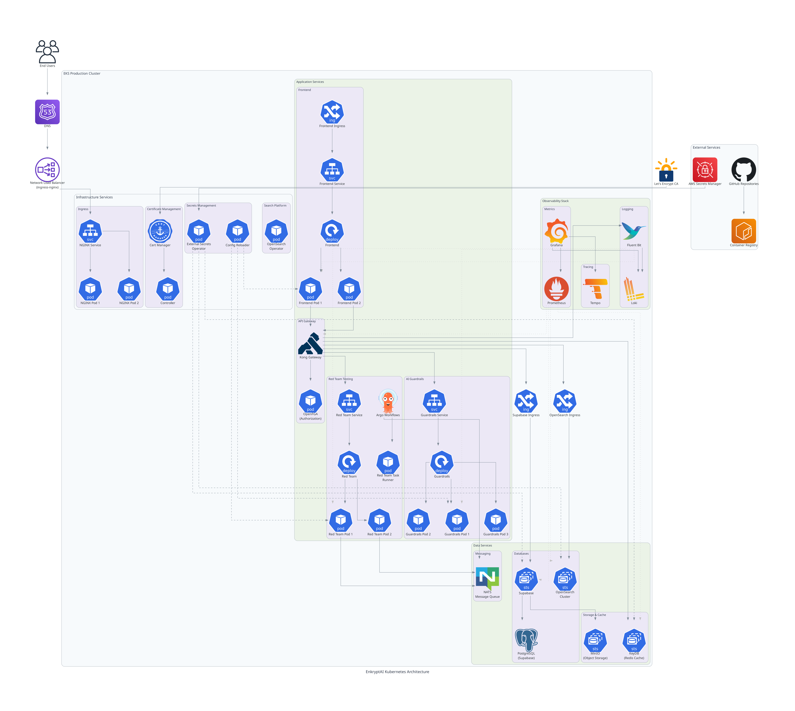

# EnkryptAI Stack Deployment

This document outlines the infrastructure and configuration requirements for deploying the [EnkryptAI](https://www.enkryptai.com/) stack on an existing Kubernetes cluster.

There are various components such as Guardrails, Redteaming etc that are required for the deployment of the EnkryptAI stack. In this document, we are giving example of AWS and EKS cluster but the chart can be used for other cloud providers as well. If you get into any issues, reach out to us or raise an issue in this Github repo.

## Architecture


## Prerequisites

### GPU Node(s) to run Guardrails

The **Guardrails** component requires GPU-enabled nodes particularly NVIDIA V100 (minimum 16 GB VRAM recommended) or above. Create a dedicated GPU node group using the following configuration.

**Node Group Name:** `gpu-node-group`

| **Configuration**         | **Value**                          |
| ------------------------- | ---------------------------------- |
| **Instance Type**         | `p3.2xlarge`                       |
| **Capacity Type**         | `ON_DEMAND`                        |
| **AMI Type**              | `AL2023_x86_64_NVIDIA`             |
| **Disk Size**             | `100 GB (gp3)`                     |
| **Scaling Configuration** | Desired: `2` • Min: `1` • Max: `2` |

> [!WARNING]
> Avoid using SPOT instances because it can lead to unexpected behavior.

> [!NOTE]
> The **Guardrails pod** requires a GPU and will be **scheduled exclusively** on this node group.

### Redteaming Node Group

The **Redteaming** workloads run on a separate node group optimized for compute-intensive tasks.

**Node Group Name:** `redteaming-node-group`

| **Configuration**         | **Value**                           |
| ------------------------- | ----------------------------------- |
| **Instance Type**         | `r7i.xlarge`                        |
| **Capacity Type**         | `ON_DEMAND`                         |
| **AMI Type**              | `AL2_x86_64`                        |
| **Disk Size**             | `100 GB (gp3)`                      |
| **Scaling Configuration** | Desired: `2` • Min: `2` • Max: `10` |
| **Labels**                | `dedicated: redteaming`             |
| **Taints**                | `app=redteaming:NoSchedule`         |

> [!NOTE]
> This node group ensures **Redteaming jobs** are scheduled exclusively on dedicated infrastructure. It is dependent on NATS, NACK,  Argo Workflows and Argo Events.


### Namespaces and Secrets

Before installing the Helm chart, make sure the following namespaces and secrets are created. EnkryptAI team will provide the secret values separately.

#### Create Namespaces

```bash
kubectl create namespace enkryptai-stack
kubectl create namespace redteam-jobs
```

#### Create Secrets

| **Namespace**   | **Secret Name**              |
| --------------- | ---------------------------- |
| enkryptai-stack | elastic-env-secret           |
| enkryptai-stack | frontend-env-secret          |
| enkryptai-stack | gateway-env-secret           |
| enkryptai-stack | gateway-migration-env-secret |
| enkryptai-stack | guardrails-env-secret        |
| enkryptai-stack | onprem                       |
| enkryptai-stack | openfga-env-secret           |
| enkryptai-stack | opensearch-cred              |
| enkryptai-stack | opensearch-securityconfig    |
| enkryptai-stack | postgres-superuser-secret    |
| enkryptai-stack | redteam-proxy-env-secret     |
| enkryptai-stack | s3-cred                      |
| enkryptai-stack | superuser-secret             |
| redteam-jobs    | redteam-proxy-env-secret     |


### Secret Usage Overview

The following table summarizes which applications use each secret.

#### Application Groups
* **Internal Applications:** `gateway-kong`, `frontend`, `redteaming`, `guardrails`
* **Self-hosted (on-prem) Platform Applications:** `opensearch`, `openfga`, `CloudNativePG`

| **Secret Name**                | **Used By**                                                          |
| ------------------------------ | -------------------------------------------------------------------- |
| `elastic-env-secret`           | `gateway-kong`, `opensearch`                                         |
| `frontend-env-secret`          | `frontend`                                                           |
| `gateway-env-secret`           | `gateway-kong`                                                       |
| `gateway-migration-env-secret` | `gateway-kong`                                                       |
| `guardrails-env-secret`        | `guardrails`                                                         |
| `onprem`                       | Supabase (on-prem database and related services)                     |
| `openfga-env-secret`           | `openfga`                                                            |
| `opensearch-cred`              | `opensearch`                                                         |
| `opensearch-securityconfig`    | `opensearch`                                                         |
| `postgres-superuser-secret`    | Supabase on-prem                                                     |
| `redteam-proxy-env-secret`     | `redteaming`, `redteam-jobs`                                         |
| `s3-cred`                      | `redteaming`, Supabase (on-prem MinIO for internal artifact storage) |
| `superuser-secret`             | Postgres CNPG credentials                                            |

### Other components required on the Kubernetes cluster

Before installing the EnkryptAI Helm charts, ensure the following components are available and configured.

### Cluster Requirements

| Component                                  | Description                                                                                                               | Installation Reference                                                                       |
| ------------------------------------------ | ------------------------------------------------------------------------------------------------------------------------- | -------------------------------------------------------------------------------------------- |
| **Kubernetes Cluster**                             | EKS Version **≥ 1.31** (tested on **v1.33.0**)                                                                                | [Kubernetes Docs](https://kubernetes.io/docs/setup/)                                         |
| **Cert Manager (AWS Certificate Manager)** | Used for managing TLS/SSL certificates for services.                                                                      | [AWS Cert Manager Setup](https://docs.aws.amazon.com/acm/latest/userguide/acm-overview.html) |
| **Ingress Controller (NGINX)**             | Required for routing external traffic to services inside the cluster.                                                     | [NGINX Ingress Controller](https://kubernetes.github.io/ingress-nginx/deploy/)               |
| **Metrics Server**                         | Required for resource metrics (CPU/Memory) used by autoscalers and monitoring.                                            | [Metrics Server Installation](https://github.com/kubernetes-sigs/metrics-server)             |

> [!NOTE]
> Ensure all components are in a **Ready** state before proceeding with Helm chart installation.

We have tested the setup with following versions:

This Helm chart setup has been **tested on Kubernetes v1.33.0** with:
* **AWS EKS** as the underlying cluster provider
* **Cert manager** for TLS management
* **NGINX Ingress Controller 1.13.3**
* **Metrics Server v0.8.0**

Compatibility with other Kubernetes versions or distributions may vary.

## Installation

### Ingress Requirements

| Service / Component        | Purpose                          | Domain         | Ingress Class (Controller) | Certificate Source                          |
|-----------------------------|----------------------------------|----------------|-----------------------------|---------------------------------------------|
| **Frontend (Web App)**      | EnkryptAI Web UI                 | `app.<domain>` | `nginx` *(or `alb` if on AWS)* | cert-manager *(Let’s Encrypt)* / ACM *(for ALB)* |
| **Gateway-Kong (API Gateway)** | Routes all backend API traffic  | `api.<domain>` | `nginx` *(or `alb`)*        | cert-manager / ACM                         |
| **Supabase (Auth Service)** | Authentication & Database APIs   | `auth.<domain>`| `nginx` *(or `alb`)*        | cert-manager / ACM                         |


### For NGINX Ingress

If you’re using **NGINX** as your ingress controller, configure TLS through **cert-manager** as shown below in your values file of enkryptai-stack helm chart:

```yaml
ingress:
  enabled: true
  className: nginx
  annotations:
    cert-manager.io/cluster-issuer: "letsencrypt-prod"
    nginx.ingress.kubernetes.io/proxy-buffer-size: "128k"
  hosts:
    - host: app.example.com
      paths:
        - path: /
          pathType: Prefix
  tls:
    - secretName: frontend-tls
      hosts:
        - app.example.com
```

Repeat similar configuration for your **API** (`api.example.com`) and **Auth** (`auth.example.com`) services.

---

### For AWS ALB Ingress (when `className: alb`)

If your environment uses **AWS Load Balancer Controller (ALB)** instead of NGINX,
you do **not** need `cert-manager` or TLS secrets.
Instead, you attach **ACM certificates** using ALB annotations directly in your values file of enkryptai-stack helm charts.

```yaml
ingress:
  enabled: true
  className: alb
  annotations:
    alb.ingress.kubernetes.io/scheme: internet-facing
    alb.ingress.kubernetes.io/listen-ports: '[{"HTTP":80},{"HTTPS":443}]'
    alb.ingress.kubernetes.io/certificate-arn: arn:aws:acm:<region>:<account-id>:certificate/<your-cert-id>
    alb.ingress.kubernetes.io/ssl-redirect: '443'
  hosts:
    - host: app.example.com
      paths:
        - path: /
          pathType: Prefix
```

>  **Note:**
>
> * The ACM certificate **must** exist in the **same AWS region** as your EKS cluster.


| When using                         | Set `ingressClassName` to | Cert managed by |
| ---------------------------------- | ------------------------- | --------------- |
| NGINX Ingress Controller           | `nginx`                   | cert-manager    |
| AWS Load Balancer Controller (ALB) | `alb`                     | AWS ACM         |


| Ingress Controller | Certificate Source            | Configuration Method                                       |
| ------------------ | ----------------------------- | ---------------------------------------------------------- |
| **NGINX**          | cert-manager (Let’s Encrypt)  | via `tls:` + `cert-manager.io/cluster-issuer`              |
| **ALB**            | AWS Certificate Manager (ACM) | via `alb.ingress.kubernetes.io/certificate-arn` annotation |


```bash
helm repo add enkryptai https://enkryptai.github.io/helm-charts
helm repo update

helm upgrade --install platform enkryptai/platform-stack -n enkryptai-stack -f values.yaml --timeout 15m

# Don't forget to apply below configmap
kubectl apply -f https://raw.githubusercontent.com/enkryptai/helm-charts/refs/heads/main/charts/enkryptai-stack/gateway-temp-config-map.yaml

helm upgrade --install enkryptai enkryptai/enkryptai-stack -n enkryptai-stack -f values.yaml --timeout 15m
```

### Provide SSL Certificates for Your Domains

Before you start using the **EnkryptAI Stack**, ensure the following subdomains are properly configured and secured with valid SSL/TLS certificates:

1. **app.<domain>** — Used by **EnkryptAI Frontend**
2. **auth.<domain>** — Used by **EnkryptAI Auth Service**
3. **api.<domain>** — Used by **EnkryptAI Kong (API Gateway)**

> Example:
> If your base domain is `example.com`, the stack will use:
>
> ```
> app.example.com
> auth.example.com
> api.example.com
> ```

Make sure you:
* Create DNS records for each subdomain.
* Attach valid SSL certificates for all three before deploying EnkryptAI Stack.


Read the documentation of each chart to perform post-installation tasks.


### Available Helm Charts

| Chart                                                   | Description                                                                  |
| ------------------------------------------------------- | ---------------------------------------------------------------------------- |
| [`enkryptai-stack`](./charts/enkryptai-stack/README.md) | Full-stack deployment including all EnkryptAI services                       |
| [`platform`](./charts/enkryptai-stack/README.md)        | Core platform dependencies and shared infrastructure                         |
| [`enkryptai-lite`](./charts/enkryptai-lite/README.md)   | Lightweight deployment — includes Red Teaming and Guardrails components only |


## Monitoring

For accessing Redteaming job logs and more, please refer to the [Monitoring documentation](./docs/monitoring.md).

## Troubleshooting

For troubleshooting, please refer to the [`Troubleshooting documentation`](./docs/troubleshooting.md)

## Security
TBD

Report security issues to [EnkryptAI Support](mailto:hello@EnkryptAI.com).

## Support

If you face any issues during deployment, reach out to the [EnkryptAI Support](mailto:hello@EnkryptAI.com) or raise a GitHub issue in this repository.
